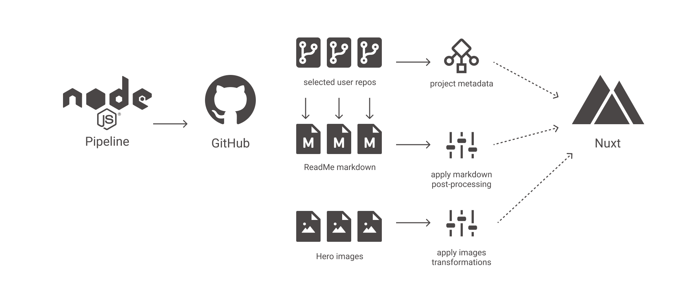
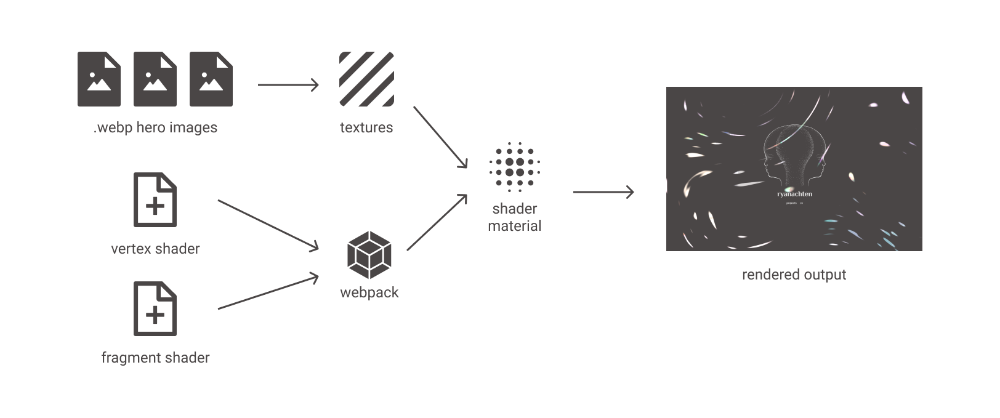
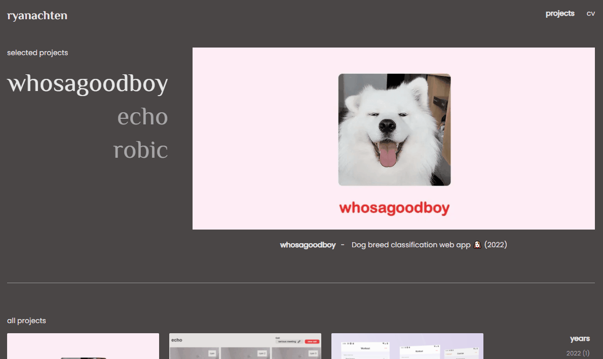
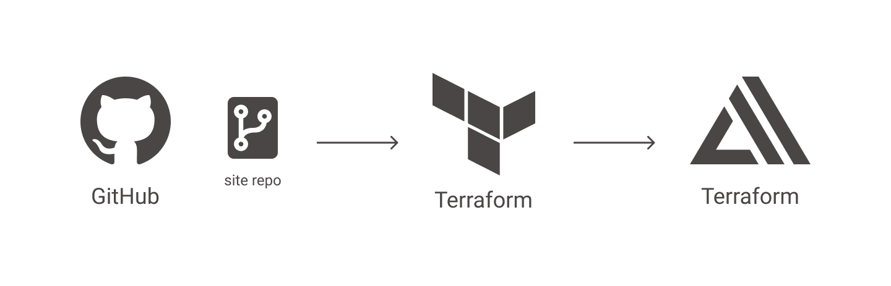

# site


Statically generated site using a Node.js data ingestion pipeline for consuming markdown and images stored in GitHub. Site also features some sweet, sweet shaders using GLSL and Three.js.

## Data Ingestion



One of the key problems with my old website was that it was cumbersome to maintain. It required a lot of content duplicated from what I was already writing in GitHub, as well as manual image processing steps.

To solve all of this, I wanted to make the new website as automated as possible. Hence the need for a data ingestion pipeline. The pipeline does the following:

### Metadata

- Given a list of projects (via `index.yml`), the pipeline will retrieve repository metadata from GitHub such as project languages, topics and archive status
- This metadata is written back to the `index.yml` file and in each project markdown file for Nuxt functionality

### Images

- Hero images defined in `index.yml` are downloaded locally
- Image transformations are applied
  - Crop image to specified aspect ratio for easier consistency in WebGL
  - Convert to `.webp` format for SEO purposes

### ReadMe

- Retrieve the main ReadMe file for each project
- It will then perform a number of post-processing tasks
  - replacing local repository references and
  - adding the metadata retrieved earlier for Nuxt page functionality

## Shader Pipeline


The pipeline used by shaders in this site are fairly simple

- Images are loaded from Nuxt static content and used to generated Three.js textures.
- vertex and fragment shader files are loaded using Webpack
- textures and shader files are combined to create a Three.js shader material which is applied to a plane to be rendered



## Infrastructure


Website is deployed using AWS Amplify, with infrastructure managed using Terraform. Because the site is statically generated, we only need to use an frontend Amplify build for this project.

## Development

General site development uses common Nuxt commands (requires Node v16).

```bash
# install dependencies
$ yarn install

# serve with hot reload at localhost:8000
$ yarn dev

# build for production and launch server
$ yarn build
$ yarn start

# generate static project
$ yarn generate
```

Guides for specific aspects of site development can be found below:

- [Infrastructure development](./infra/README.md)
- [Sync pipeline development](./sync/README.md)
